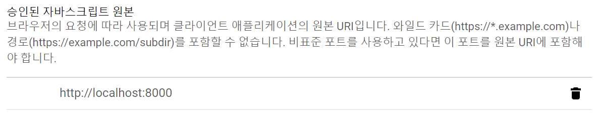

# vue-google-calendar

> 승인된 자바스크립트 원본에 localhost:8000, 또는 jsfiddle 에서 하려면 https://jsfiddle.net, https://jsfiddle.shell.net 을 추가하면 됩니다.


## Build Setup

``` bash
# install dependencies
npm install

# serve with hot reload at localhost:8080
npm run dev

# build for production with minification
npm run build

# build for production and view the bundle analyzer report
npm run build --report
```
